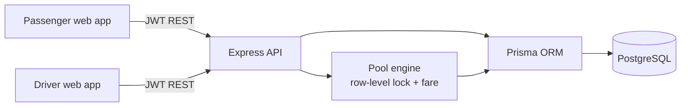
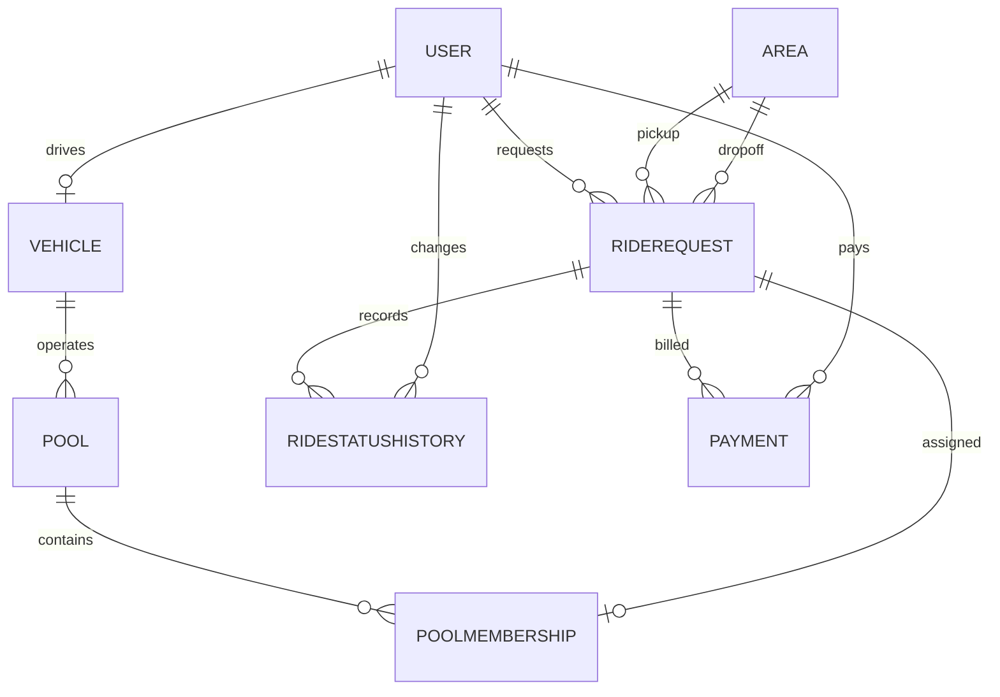

# Dhaka Tesla

Shared electric rides for Banani rush hour. The MVP pairs passengers in Jashim’s three-seat electric 3-wheeler, the **Bullet**, with a live ride lifecycle, fare estimates, and seat-safe pooling.

## Quick start

Requirements: Docker Desktop with Compose v2. From the repository root:

1. Copy `.env.example` to `.env` and replace the JWT secret before exposing this service beyond a local demo.
2. Run `docker compose up --build`.
3. Open [http://localhost:3000](http://localhost:3000). API health is at [http://localhost:4000/health](http://localhost:4000/health).

Compose waits for PostgreSQL health, pushes the Prisma schema, seeds demo actors and launches the API. The frontend uses the API URL at build time via `NEXT_PUBLIC_API_URL`.

### Demo accounts

All accounts use password `tesla2026`.

| Role | Actor | Email |
|---|---|---|
| Driver | Jashim | `driver@teslapool.demo` |
| Passenger | Nusrat (Banani → Mohakhali) | `passenger1@teslapool.demo` |
| Passenger | Rafiq (Banani → Gulshan 1) | `passenger2@teslapool.demo` |
| Passenger | Shirin (Banani → Gulshan 1) | `passenger3@teslapool.demo` |

Seed data starts Jashim online, with Nusrat and Rafiq in the Bullet pool (2/3 seats) and Shirin’s request waiting. The seed is safe to run repeatedly.

## Monorepo layout

- `backend/` — Express 5 + TypeScript API, Prisma schema/seed, PostgreSQL row-locked pool engine, Jest/Supertest integration suite.
- `frontend/` — Next.js App Router + TypeScript + Tailwind responsive passenger and driver dashboards.
- `docker-compose.yml` — PostgreSQL, API, frontend, health checks, and persistent database volume.
- `.env.example` — safe local configuration template.

## Architecture



## Visual Scenario Overview

Illustrative seat allocation: after Nusrat and Rafiq take one seat each, Shirin's two-seat request cannot fit in the remaining seat. The current seed keeps Shirin's request waiting for driver action.

```text
🛺 Visual Scenario Overview
            BANANI ROAD 11 (PICKUP ZONE)
  ┌─────────────────────────────────────────────────────────────────┐
  │                                                                 │
  │   👤 Nusrat               👤 Rafiq              👤 Shirin        │
  │   (Wants 1 seat)          (Wants 1 seat)        (Wants 2 seats) │
  └───────┬───────────────────────┬─────────────────────┬───────────┘
      │                       │                     │
      │ Request 1             │ Request 2           │ Request 3
      ▼                       ▼                     ▼
┌───────────────────────────────────────────────────────────────────┐
│                        BACKEND POOL ENGINE                        │
│                                                                   │
│  • Matches configured routes when the driver accepts              │
│  • Calculates the pooled fare discount in paisa                    │
│  • Enforces a SQL row-level lock on Bullet's 3-seat capacity       │
└─────────────────────────────────┬─────────────────────────────────┘
                  │
                  ▼
           JASHIM'S TESLA ("BULLET") 🛺⚡
             [ 💺 Seat 1 | 💺 Seat 2 | 💺 Seat 3 ]
                  │
   ┌────────────────────────────┼────────────────────────────┐
   │                            │                            │
   ▼                            ▼                            ▼
✅ APPROVED                  ✅ APPROVED                  ❌ REJECTED
Nusrat assigned             Rafiq assigned               Shirin blocked
(1 seat taken)              (2 seats taken)              (Requires 2 seats;
                              only 1 left!)
```

## Data model (ERD)



## Technology choices

- **TypeScript on both tiers** keeps request and UI logic maintainable while making contracts explicit.
- **Express** is deliberately small for a focused MVP; Zod validates incoming payloads and JWT middleware protects role-specific routes.
- **Prisma + PostgreSQL** provide relational constraints, migrations/schema tooling, transactions, and row-level locking needed for race-safe seat allocation.
- **Next.js App Router + Tailwind** deliver fast route-based passenger/driver views and responsive styling without an extra component dependency.
- **Integer Poysha/Paisa** is used for every stored estimate, final fare, membership fare, and payment amount. Display conversion to BDT happens only at the UI boundary (100 paisa = 1 BDT).

## Fare model

The deterministic pooled fare is calculated with integer arithmetic:

`passengerFare = baseFare + distanceCharge - poolDiscount`

- Base fare: 5,000 paisa.
- Distance charge: 2,000 paisa per configured route kilometre, rounded to an integer.
- Pool discount: 20% of base fare plus distance charge, rounded to an integer.
- Banani → Mohakhali is configured as 3.5 km: 9,600 paisa (৳96.00).
- Banani → Gulshan 1 is configured as 2.2 km: 7,520 paisa (৳75.20).

Only configured Banani routes are fare-enabled in this MVP. Unsupported routes are rejected rather than guessed.

## Concurrency and ride lifecycle

`POST /pools/:id/join` opens a Prisma interactive transaction and locks its pool row with PostgreSQL `SELECT ... FOR UPDATE`. It then reads the occupied-seat aggregate while holding that lock and checks `occupiedSeats + requestedSeats <= vehicle.capacity` before inserting membership and changing the ride to `MATCHED`. Concurrent claims for the last available seats serialize on the same row; one succeeds and the next receives HTTP 409 with `POOL_CAPACITY_EXCEEDED`. The test suite exercises two concurrent claims for a single remaining seat against PostgreSQL.

The driver dashboard reports total completed ride earnings from pool membership fares, in paisa; the UI converts this total to Taka for display.

Allowed ride state transitions are enforced centrally:

```text
REQUESTED → MATCHED → DRIVER_ARRIVED → STARTED → COMPLETED
     └─────────────── CANCELLED (before trip start)
```

Invalid jumps (including `COMPLETED → STARTED`) return HTTP 409 `INVALID_STATE_TRANSITION`. The driver must own the pool to perform lifecycle actions.

## API overview

All routes except `/health` and `/auth/*` require `Authorization: Bearer <JWT>`.

| Method | Route | Access |
|---|---|---|
| POST | `/auth/login`, `/auth/register` | Public |
| GET | `/areas`, `/pools` | Signed in |
| POST / GET | `/rides`, `/rides/:id` | Passenger create; ride owner or assigned driver read |
| POST | `/rides/:id/cancel` | Ride’s passenger |
| POST | `/pools/:id/join` | Passenger; sends `{ "rideId": "..." }` |
| GET | `/passenger/dashboard` | Passenger |
| POST | `/driver/online` | Driver; sends `{ "isOnline": true }` |
| GET | `/driver/dashboard` | Driver |
| POST | `/rides/:id/accept`, `/arrive`, `/start`, `/complete` | Assigned driver |

## Local development and tests

Without Docker, start PostgreSQL and set `DATABASE_URL` and `JWT_SECRET`, then from `backend/` run `npm install`, `npx prisma generate`, `npx prisma db push`, `npm run db:seed`, and `npm run dev`. In another terminal, from `frontend/`, run `npm install` and `npm run dev` (set `NEXT_PUBLIC_API_URL=http://localhost:4000` if needed).

Run backend integration tests with PostgreSQL available and `DATABASE_URL` set: from `backend/`, run `npm test`. Tests cover the three-seat limit, invalid transitions, Nusrat/Rafiq fares, and simultaneous claims for the last seat. Tests create namespaced test fixtures and do not truncate the demo database.

### Vercel CORS and Render seeding

The API accepts browser requests from `http://localhost:3000`, HTTPS `*.vercel.app` deployments, and exact origins configured in `FRONTEND_URL` (comma-separated origins are supported). Credentialed requests are enabled. Configure `FRONTEND_URL` on the backend deployment, for example `https://your-app.vercel.app`; do not use `*` with credentials.

Before seeding, synchronize the Render database with the current Prisma schema. This MVP adds `User.balancePaisa` with a database default of `0`; an older database must receive that column before the generated Prisma Client can query users. `db push` below does not reset the database and deliberately omits `--accept-data-loss`. Review Prisma's proposed changes and stop if it reports destructive changes. For a mature production workflow, replace schema push with reviewed Prisma migrations.

Use Render's **External Database URL** from a trusted terminal. In production, set a strong `SEED_PASSWORD`; the seed script refuses to create or reset the four actor accounts with a known development password. Run from the repository root. The secure prompts keep the URL and seed password out of PowerShell command history, and the `finally` block clears them afterward:

```powershell
Set-Location .\backend
$databaseUrl = Read-Host 'Render External Database URL' -AsSecureString
$seedPassword = Read-Host 'Password for seeded accounts' -AsSecureString
$env:DATABASE_URL = [System.Net.NetworkCredential]::new('', $databaseUrl).Password
$env:NODE_ENV = 'production'
$env:SEED_PASSWORD = [System.Net.NetworkCredential]::new('', $seedPassword).Password
try {
  npx prisma generate
  if ($LASTEXITCODE -ne 0) { throw 'Prisma Client generation failed.' }

  npx prisma db push
  if ($LASTEXITCODE -ne 0) { throw 'Prisma schema synchronization failed.' }

  npx prisma db seed
  if ($LASTEXITCODE -ne 0) { throw 'Database seeding failed.' }
}
finally {
  Remove-Item Env:DATABASE_URL, Env:NODE_ENV, Env:SEED_PASSWORD -ErrorAction SilentlyContinue
}
```

The seed command is idempotent for its actors, vehicle, areas, and sample rides. Treat seeded production actor accounts as operational accounts: distribute their password securely and rotate it after the initial seed if needed.

## Security and MVP boundaries

This is a local MVP, not production-hardened. Replace the development JWT secret, use TLS, rate-limit login, add operational logging/monitoring, and review payment settlement before launch. `TeslaPay` is represented as a pending payment record; no real payment provider is integrated. Matching is driver-accepted in this release; route optimization and maps are intentionally out of scope.

## AI usage notes

- **Accepted suggestion:** serialize pool-seat claims by locking the pool row before computing occupied seats; this is implemented and covered by the concurrent integration test.
- **Rejected suggestion:** allow a browser-only optimistic seat counter to make matching feel instant. It was rejected because client-side seat counts cannot prevent oversubscription across concurrent users; PostgreSQL remains authoritative.

## Viral scaling: 1M passengers / 100k drivers

The MVP’s single-pool-per-vehicle and direct polling pattern is intentionally simple. At 1 million passengers and 100,000 drivers:

1. Partition the service by city/zone, keep PostgreSQL as the source of truth, and shard or partition ride/history/payment tables by city and time after profiling. Keep pool seat allocation transactions short and use a pool row as the serialization boundary; avoid cross-pool transactions.
2. Add Redis-backed geospatial candidate discovery and a durable event bus (Kafka/Pulsar) for ride-request, match, lifecycle, and notification events. Treat these as discovery/fan-out layers only; confirm all seat claims transactionally in PostgreSQL.
3. Scale stateless API instances horizontally behind a gateway; add per-user rate limits, idempotency keys, circuit breakers, and backpressure for request spikes.
4. Replace five-second dashboard polling with authenticated WebSocket/SSE updates, partitioned by city and pool; use push notifications for backgrounded clients.
5. Read dashboards from replicas/materialized views or event-fed projections. Keep payment ledger writes auditable and asynchronous settlement separate from matching.
6. Instrument pool-lock wait time, 409 rate, match latency, queue depth, connection-pool saturation, and per-zone supply/demand; add autoscaling and load tests before rollout.

## Git branch topology

- `master` — protected stable development baseline; reviewed, passing changes only.
- `pre-release` — integration and release-candidate validation branch, deployable to staging.
- `release/v1.0.0` — frozen v1.0.0 release branch for final QA, hotfixes, and tagged production artifact.

Promote changes `master` → `pre-release` → `release/v1.0.0`; merge approved fixes back down to prevent branch drift.

## Six-minute Loom walkthrough outline

- **0:00–0:40 — Product:** explain the Banani rush-hour use case, Bullet’s fixed three-seat capacity, and the four demo actors.
- **0:40–1:30 — Passenger:** sign in as Nusrat, show the Banani → Mohakhali request, integer-backed fare, pool card, and status tracker.
- **1:30–2:15 — Driver:** switch to Jashim, show online state, 2/3 seats, passenger roster, Shirin’s waiting request, and accept it if running against a fresh seed.
- **2:15–3:00 — Lifecycle:** demonstrate arrived → started → completed and fare/payment status creation.
- **3:00–4:15 — Architecture:** review Prisma relations, API boundaries, Docker health checks, and demo bootstrap.
- **4:15–5:15 — Concurrency:** explain the transaction’s `FOR UPDATE` lock and show the test where two claims compete for one remaining seat (one success, one 409).
- **5:15–6:00 — Roadmap:** discuss production security, real TeslaPay integration, live updates, and zone-based scaling.
